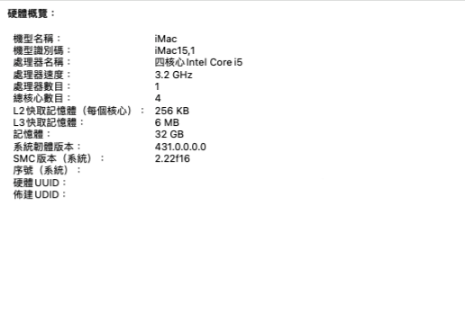
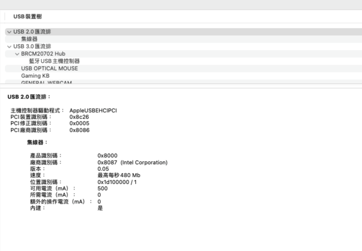
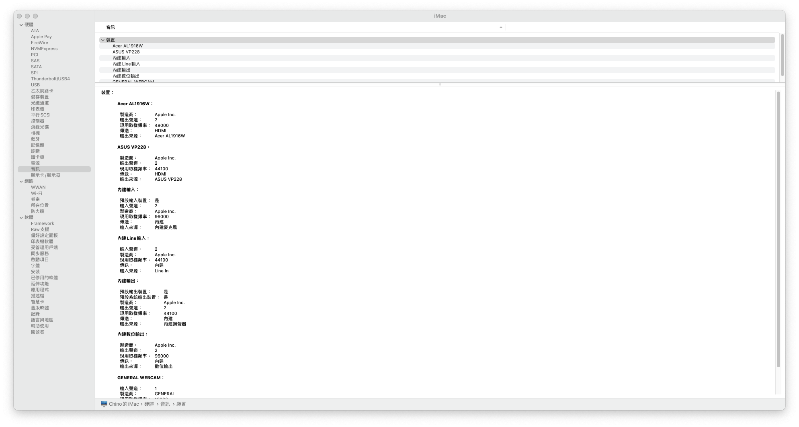
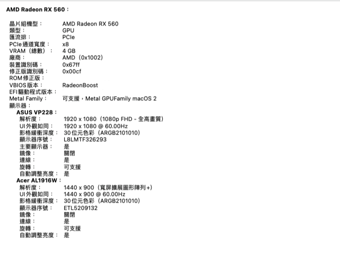
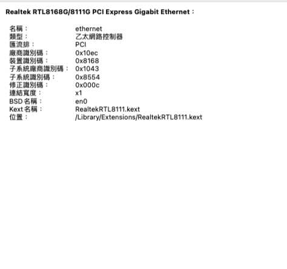

### 🌐語言
[English](README.md) | [中文](README-zh.md)

# 🍎華碩 B85M-G 黑蘋果

## 🖥️設備
主板:Asus B85M-G.

BIOS版本:0940.

CPU:i5 4460,4570.

獨顯:AMD Radeon RX560.

內顯:HD4600.

音頻:Realtek ALC887.

記憶體:32GB.

有線/無線網路:Realtek 8111/BCM4360.

## 📀系統

OS:MacOS Monterey 12.0.1

SMBIOS:iMac 17.1

## 🛠️OC DevicePropertises設定

   內顯+獨顯硬件加速 |  只使用獨顯(DVI)  |  音頻
:-------------------------:|:-------------------------:|:-------------------------:
PciRoot(0x0)/Pci(0x2,0x0)|PciRoot(0x0)/Pci(0x2,0x0)|PciRoot(0x0)/Pci(0x1B,0x0)
AAPL,ig-platform-id:04001204(DATA)|AAPL,ig-platform-id:0300220D(DATA)|layout-id:05000000(DATA)
device-id:12040000(DATA)|device-id:12040000(DATA)|-
model:Intel HD Graphics 4600(STRING)|framebuffer-fbmem:00009000(DATA)|-
-|framebuffer-stolenmem:00003001(DATA)|-
-|model:Intel HD Graphics 4600(STRING)|-

## 🛠️設定BIOS
### Hard drive:

SATA Modle:AHCI

### CPU:

Advanced/CPU Configuration/Intel Virtuallzation Technology:Enabled

Advanced/System Agent Configuration/VT-d:Disabled

### iGPU:

Advanced/System Agent Configuration/Primary Display:iGPU

Advanced/System Agent Configuration/iGPU Memory:64M

### dGPU:

Advanced/System Agent Configuration/Primary Display:PCIE

### dGPU+iGPU:

Advanced/System Agent Configuration/Primary Display:PCIE

Advanced/System Agent Configuration/iGPU Memory:64M

Advanced/System Agent Configuration/iGPU Multi-Momltor:Enabled

### USB:

Advanced/USB Configuraton/Legacy USB Support:Enabled

Advanced/USB Configuraton/Intel xHCI Mode:Enabled

Advanced/USB Configuraton/EHCI Hand-off:Enabled

### Fix Sleep:

Advanced/Onboard Devices Configuration/Serial Port Configuration/Serial Port:Disabled

### Boot:

Boot/Fast Boot:Disabled

Boot/CSM/Launch CSM: Disabled

Boot/Secure Boot menu/OS Type:Other OS

## 💡設備狀態

😪睡眠:正常

💾USB設備:正常

🔊音頻:正常,注入alcid=5

💻內顯:協助獨顯硬件加速/獨顯:正常

📡有線/無線網路:正常

