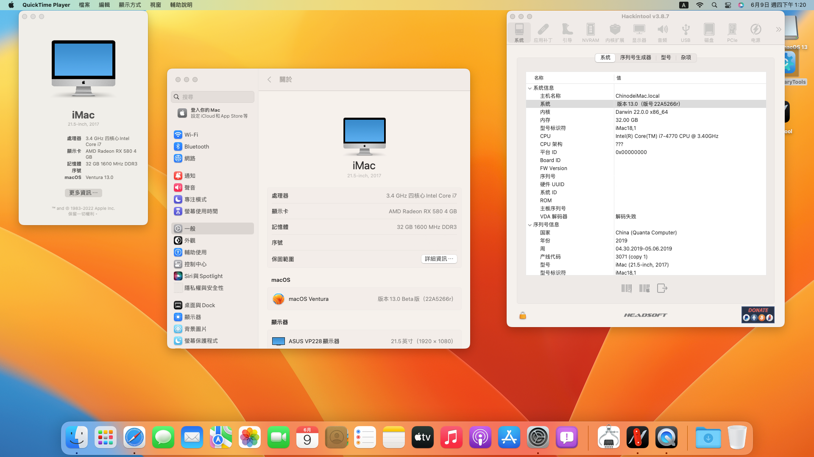

### 🌐Language
[English](README.md) | [中文](README-zh.md)

# 🍎ASUS-B85M-G-Haswell-Hackintosh 

## 🖥️設備

| 主板 | Asus B85M-G |
|------------|-------------------------------|
| CPU | i5 4460,4570,i7 4770(Haswell) |
| 獨顯dGPU | AMD Radeon RX580 |
| 內顯iGPU | Intel® HD Graphics 4600 |
| 記憶體 | 32GB |
| 音頻 | Realtek ALC887 |
| WIFI／Bluetooth | FV-T919(BCM94360cd) |
| 內建網卡 | Realtek® 8111G |
| BIOS版本 | 0904 |

## 📀系統

### 注意:
在macOS Ventura上無法驅動帶有Haswell cpu的核顯，需要安裝獨顯
 
|  |
|------------|
| <a href="https://www.apple.com/tw/macos/macos-ventura-preview/">macOS Ventura 13(beta) |
| <a href="https://github.com/acidanthera/OpenCorePkg/releases/tag/0.8.1">Opencore 0.8.1 |
| <a href="https://dortania.github.io/OpenCore-Install-Guide/extras/smbios-support.html#how-to-decide">iMac 19.1 |

- 下載:https://github.com/ParrotXray/ASUS-B85M-G-Haswell-OC-Hackintosh/releases/download/v0.8.1.Ventura/Opencore.0.8.1.build-macOS.Ventura.zip
 
|  |
|------------|
| <a href="https://www.apple.com/tw/macos/monterey/">macOS Monterey 12.4 |
| <a href="https://github.com/acidanthera/OpenCorePkg/releases/tag/0.8.1">Opencore 0.8.1 |
| <a href="https://dortania.github.io/OpenCore-Install-Guide/extras/smbios-support.html#how-to-decide">iMac 17.1 | 

- 下載:https://github.com/ParrotXray/ASUS-B85M-G-Haswell-OC-Hackintosh/releases/download/v0.8.1/Opencore.0.8.1.build.zip
 
## 💡設備狀態
### 正常工作：
- [x] 顯卡
- [x] USB
- [x] 睡眠
- [x] WiFi
- [x] 揚聲器
- [x] 麥克風
- [x] 藍芽
- [x] 內建網卡
### 未知：
- [ ] Apple服務

## 🛠️OC DevicePropertises設定

| 使用iGPU+dGPU硬件加速 |  使用iGPU(DVI)  |  音頻
:-------------------------:|:-------------------------:|:-------------------------:
PciRoot(0x0)/Pci(0x2,0x0)|PciRoot(0x0)/Pci(0x2,0x0)|PciRoot(0x0)/Pci(0x1B,0x0)
AAPL,ig-platform-id:04001204(DATA)|AAPL,ig-platform-id:0300220D(DATA)|layout-id:05000000(DATA)
device-id:12040000(DATA)|device-id:12040000(DATA)|-
model:Intel HD Graphics 4600(STRING)|framebuffer-fbmem:00009000(DATA)|-
-|framebuffer-stolenmem:00003001(DATA)|-
-|model:Intel HD Graphics 4600(STRING)|-

## 🛠️BIOS設定
  
#### CFG鎖:

- BIOS 預設已解鎖

#### SATA:

- Advanced/SATA Configuration/SATA Mode Selection：`AHCI`

#### CPU:

- Advanced/CPU Configuration/Intel Virtuallzation Technology：`Enabled`

- Advanced/System Agent Configuration/VT-d：`Disabled`

#### USB:

- Advanced/USB Configuraton/Legacy USB Support：`Enabled`

- Advanced/USB Configuraton/Intel xHCI Mode：`Enabled`

- Advanced/USB Configuraton/EHCI Hand-off：`Enabled`

#### Fix Sleep:

- Advanced/Onboard Devices Configuration/Serial Port Configuration/Serial Port：`Disabled`

#### Boot:

- Boot/Fast Boot：`Disabled`

- Boot/CSM/Launch CSM：`Disabled`

- Boot/Secure Boot menu/OS Type：`Other OS`

### GPU設定

#### 只使用iGPU:

- Advanced/System Agent Configuration/Primary Display：`iGPU`

- Advanced/System Agent Configuration/iGPU Memory：`64M`

#### 只使用dGPU:

- Advanced/System Agent Configuration/Primary Display：`PCIE`

#### 使用dGPU+iGPU硬件加速:

- Advanced/System Agent Configuration/Primary Display：`PCIE`

- Advanced/System Agent Configuration/iGPU Memory：`64M`

- Advanced/System Agent Configuration/iGPU Multi-Momltor：`Enabled`
