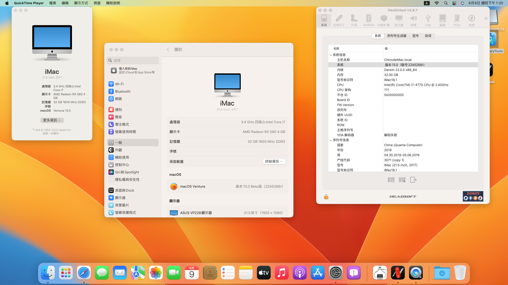
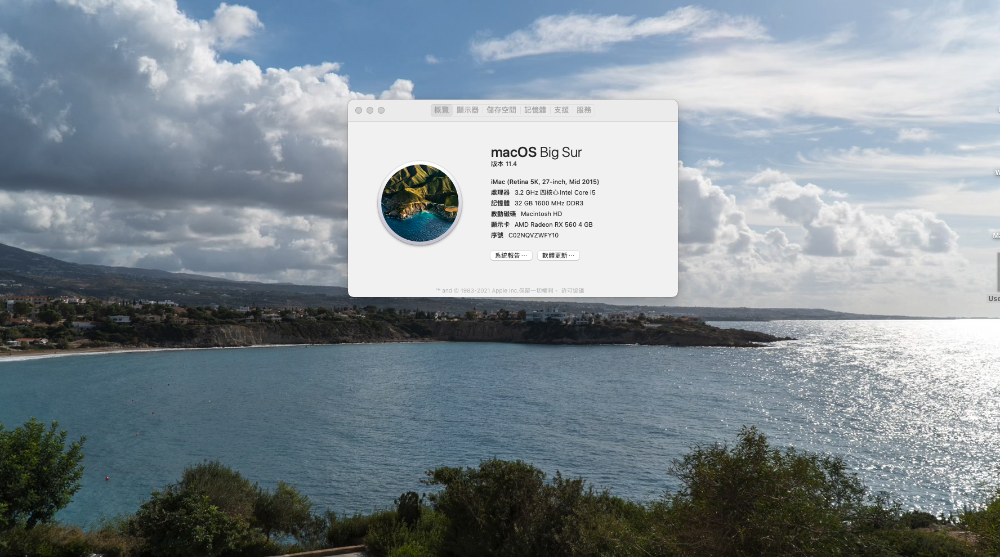

### 🌐Language
[English](README.md) | [中文](README-zh.md)

# ASUS-B85M-G-Haswell-Hackintosh 

## 🖥️Device

| Motherboard | Asus B85M-G |
|------------|-------------------------------|
| CPU | i5 4460,4570/i7 4770(Haswell 1150 CPUs) |
| dGPU | AMD Radeon RX580 |
| iGPU | Intel® HD Graphics 4600 |
| RAM | DDR3 1600MHz 32GB |
| Audio | Realtek ALC887 |
| WIFI／Bluetooth | FV-T919(BCM94360cd) |
| Ethernet | Realtek® 8111G |
| BIOS Version | 1011 |

## OS

### macOS Ventura 

**Noteice**:  
iGPU with Haswell cpu cannot be driven on macOS Ventura, dGPU needs to be installed(The success of driving nuclear display with OCLP can be proposed in lssues)

|  |
|------------|
| <a href="https://www.apple.com/tw/macos/macos-ventura-preview/">macOS Ventura 13.0.1 |
| <a href="https://github.com/acidanthera/OpenCorePkg/releases/tag/0.8.7">Opencore 0.8.7 |
| <a href="https://dortania.github.io/OpenCore-Install-Guide/extras/smbios-support.html">MacPro 7.1 |

- <a href="https://github.com/ParrotXray/ASUS-B85M-G-Haswell-OC-Hackintosh/releases/tag/v0.8.7">Click me to download EFI file

### macOS Monterey

|  |
|------------|
| <a href="https://support.apple.com/zh-tw/HT212585">macOS Monterey 12.6.1 |
| <a href="https://github.com/acidanthera/OpenCorePkg/releases/tag/0.8.7">Opencore 0.8.7 |
| <a href="https://dortania.github.io/OpenCore-Install-Guide/extras/smbios-support.html#how-to-decide">iMac 17.1 | 

- <a href=https://github.com/ParrotXray/ASUS-B85M-G-Haswell-OC-Hackintosh/releases/tag/v0.8.4>Click me to download EFI file

## 💡Device status
### Works：
- [x] Graphics
- [x] USB
- [x] Sleep
- [x] WiFi
- [x] Speakers
- [x] Microphone
- [x] Bluetooth
- [x] Ethernet
- [x] AirDrop
### Unkown：
- [ ] Apple Services

## 🛠️OC DevicePropertises setting

| Use iGPU+dGPU hardware acceleration |  Use iGPU(DVI)  |  Audio
:-------------------------:|:-------------------------:|:-------------------------:
PciRoot(0x0)/Pci(0x2,0x0)|PciRoot(0x0)/Pci(0x2,0x0)|PciRoot(0x0)/Pci(0x1B,0x0)
AAPL,ig-platform-id:04001204(DATA)|AAPL,ig-platform-id:0300220D(DATA)|layout-id:05000000(DATA)
device-id:12040000(DATA)|device-id:12040000(DATA)|-
model:Intel HD Graphics 4600(STRING)|framebuffer-fbmem:00009000(DATA)|-
-|framebuffer-stolenmem:00003001(DATA)|-
-|model:Intel HD Graphics 4600(STRING)|-

## 🛠️Setting BIOS

#### CFG lock:
- The BIOS preset is unlocked

#### SATA:

- Advanced/SATA Configuration/SATA Mode Selection：`AHCI`

#### CPU:

- Advanced/CPU Configuration/Intel Virtuallzation Technology：`Enabled`

- Advanced/System Agent Configuration/VT-d：`Disabled`

#### USB:

- Advanced/USB Configuraton/Legacy USB Support：`Enabled`

- Advanced/USB Configuraton/Intel xHCI Mode：`Enabled`

- Advanced/USB Configuraton/EHCI Hand-off：`Enabled`

#### Fix Sleep:

- Advanced/Onboard Devices Configuration/Serial Port Configuration/Serial Port：`Disabled`

#### Boot:

- Boot/Fast Boot：`Disabled`

- Boot/CSM/Launch CSM：`Disabled`

- Boot/Secure Boot menu/OS Type：`Other OS`

### GPU Settings

#### Use iGPU:

- Advanced/System Agent Configuration/Primary Display：`iGPU`

- Advanced/System Agent Configuration/iGPU Memory：`64M`

#### Use dGPU:

- Advanced/System Agent Configuration/Primary Display：`PCIE`

#### Use dGPU+iGPU hardware acceleration:

- Advanced/System Agent Configuration/Primary Display：`PCIE`

- Advanced/System Agent Configuration/iGPU Memory：`64M`

- Advanced/System Agent Configuration/iGPU Multi-Momltor：`Enabled`
