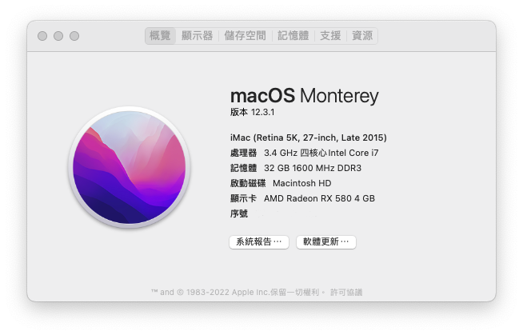

### 🌐Language
[English](README.md) | [中文](README-zh.md)

# 🍎Asus B85M-G Hackintosh 

## 🖥️Device
MB:Asus B85M-G.

BIOS version:0940.

CPU:i5 4460,4570.

dGPU:AMD Radeon RX560.

iGPU:HD4600.

Audio:Realtek ALC887.

Memory:32GB.

Ethernet/WIFI:Realtek 8111/BCM4360.

## 📀System

OS:MacOS Monterey 12.0.1

SMBIOS:iMac 17.1

## 🛠️OC DevicePropertises setting

   iGPU+dGPU hardware acceleration |  Use iGPU(DVI)  |  Audio
:-------------------------:|:-------------------------:|:-------------------------:
PciRoot(0x0)/Pci(0x2,0x0)|PciRoot(0x0)/Pci(0x2,0x0)|PciRoot(0x0)/Pci(0x1B,0x0)
AAPL,ig-platform-id:04001204(DATA)|AAPL,ig-platform-id:0300220D(DATA)|layout-id:05000000(DATA)
device-id:12040000(DATA)|device-id:12040000(DATA)|-
model:Intel HD Graphics 4600(STRING)|framebuffer-fbmem:00009000(DATA)|-
-|framebuffer-stolenmem:00003001(DATA)|-
-|model:Intel HD Graphics 4600(STRING)|-

## 🛠️Setting BIOS
### Hard drive:

SATA Modle:AHCI

### CPU:

Advanced/CPU Configuration/Intel Virtuallzation Technology:Enabled

Advanced/System Agent Configuration/VT-d:Disabled

### iGPU:

Advanced/System Agent Configuration/Primary Display:iGPU

Advanced/System Agent Configuration/iGPU Memory:64M

### dGPU:

Advanced/System Agent Configuration/Primary Display:PCIE

### dGPU+iGPU:

Advanced/System Agent Configuration/Primary Display:PCIE

Advanced/System Agent Configuration/iGPU Memory:64M

Advanced/System Agent Configuration/iGPU Multi-Momltor:Enabled

### USB:

Advanced/USB Configuraton/Legacy USB Support:Enabled

Advanced/USB Configuraton/Intel xHCI Mode:Enabled

Advanced/USB Configuraton/EHCI Hand-off:Enabled

### Fix Sleep:

Advanced/Onboard Devices Configuration/Serial Port Configuration/Serial Port:Disabled

### Boot:

Boot/Fast Boot:Disabled

Boot/CSM/Launch CSM: Disabled

Boot/Secure Boot menu/OS Type:Other OS

## 💡Device stetus

😪Sleep:normal

💾USB Device:normal

🔊Audio:normal,injact alcid=5

💻iGPU:Assist dGPU hardware acceleration/dGPU:normal

📡WIFI/Ethernet:normal

